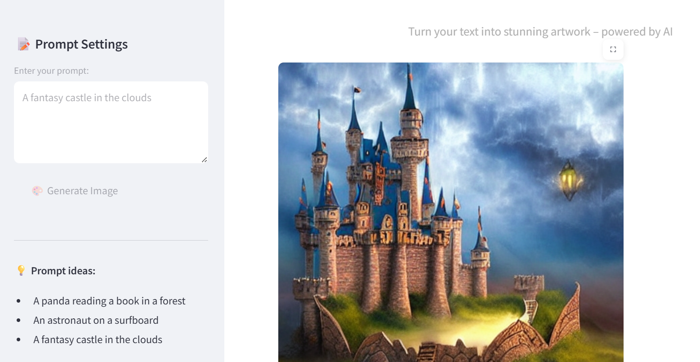
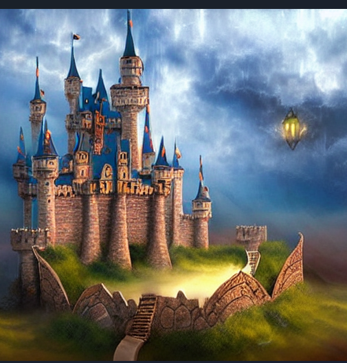

# 🎨 Stable Diffusion Streamlit App

This project is a **stylish and minimal web application** built with **Streamlit** that uses the **Stable Diffusion v1-4 model** from Hugging Face to generate AI-powered images from text prompts — entirely on **CPU**, with **no GPU required**.



> ✨ Clean UI · 💻 CPU-Only · 🧠 Diffusion-powered · 🚀 Streamlit-friendly

---

## 📸 Example Prompt

> `"A fantasy castle in the clouds"`

Produces an image matching the prompt using the Stable Diffusion model.



---

## 🛠️ Features

- ✅ Text-to-image generation with **Stable Diffusion**
- ✅ Runs entirely on CPU (no CUDA/GPU required)
- ✅ Beautiful custom UI with **dark mode** styling
- ✅ Prompt input and real-time generation
- ✅ Hugging Face integration using `diffusers`
- ✅ Easy deployment to **Streamlit Cloud**

---

## 🔒 Get your token 
Go to: https://huggingface.co/settings/tokens

Click New token

Name it (e.g. streamlit-app) and choose Read access

Copy the token

paste it here 
**use_auth_token="insert_your_token_here",**

### 🚀 How to Clone the Repository

```bash
git clone https://github.com/nadasaidi23/stable-diffusion-streamlit.git
cd stable-diffusion-streamlit


